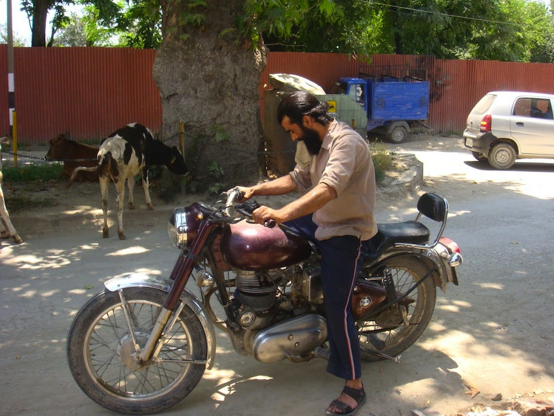
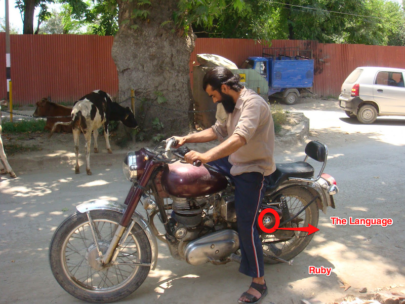

!SLIDE
# Debugging Ruby #

!SLIDE
# About Me #

!SLIDE bullets

* @gnufied
* Brightbox Systems (http://brightbox.com/)

!SLIDE
# Change of Plans #

!SLIDE
# CPU and Memory profiling for Ruby Applications #

!SLIDE
# 1.9 is the future, 1.8 is dead #

!SLIDE smaller
## This slide was inserted as last minute gesture ##

    @@@ ruby
    ~> showoff serve
    Program received signal EXC_BAD_ACCESS, Could not access memory.
    Reason: KERN_INVALID_ADDRESS at address: 0x0000000000000010
    [Switching to process 15862 thread 0x1b03]
    0x00000001034c37bc in gomp_resolve_num_threads ()(gdb) bt
    #0  0x00000001034c37bc in gomp_resolve_num_threads ()
    #1  0x000000010331a6a5 in AcquirePixelCache ()
    #2  0x0000000103475ee2 in ReadStream ()
    #3  0x0000000103349f65 in PingImage ()
    #4  0x0000000100745633 in rd_image ()
    
    # sshh... 
    ~> rbenv local ree-187
    ~> showoff serve
    .... phew .....

!SLIDE smaller
## Keep debug build of Ruby handy, so as you can tell apples from oranges. ##

    @@@ ruby
    ./configure --enable-shared \
        --disable-install-doc optflags="-O0" \
        debugflags="-g3 -gdb"
    
!SLIDE

!SLIDE

!SLIDE

    

!SLIDE 
# Back back - 1.9 is the future, remember? #
    
!SLIDE
# Before you rewrite sh*t in Scala, PROFILE! #

!SLIDE
# Profiling tools #

!SLIDE bullets incremental
# The Bad News #

* Bleakhouse 
* memprof 
* ruby-prof - Only CPU profiling works

!SLIDE bullets incremental
# The Good News #

* ruby-prof , cpu profiling works
* perftools.rb
* memprof 
* gdb.rb

