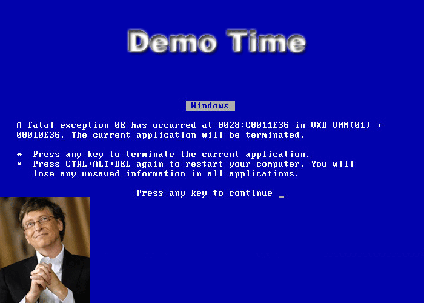

!SLIDE
# CPU Profiling #

!SLIDE smaller center

    @@@ c
    rb_add_event_hook(event_handler, 
                RUBY_EVENT_CALL|RUBY_EVENT_C_CALL, Qnil);
	    
!SLIDE
# Tools #

!SLIDE bullets incremental

* perftools.rb
* ruby-prof
* llprof

!SLIDE 
# Perftools.rb #

!SLIDE bullets incremental

* Based on Google Perftools.
* patched to profile Ruby Programs.
* A sampling profiler, but can be used for method or object profiling.

!SLIDE transition=curtainY

!SLIDE
# Profiling Simple Ruby Program #

.notes rbenv global ruby_192 && cd ~/rubyconf/scripts/perftools/more_complex_oo.rb

!SLIDE
# Profiling Rails Application #
.notes rbenv global ruby_192 && cd scripts/perftools/bar && be rails s -e production

!SLIDE 
# Output of Simple Ruby Program #

!SLIDE
# Output of Rails Application #

!SLIDE
# ruby-prof #

!SLIDE bullets incremental
* A Profiler written in C, uses `rb_add_event_hook`
* Supports various kind of Reports.
* Can do memory profiling.

!SLIDE transition=curtainY

<audio id="audiotag1" type="audio/mp3" src="/image/02cpu_profiling/drum_roll.mp3" autoplay="true" preload="auto" control="play" ></audio>

!SLIDE
# Profiling Simple Ruby Program #

!SLIDE
# Output of Profiling Simple Ruby Program #

!SLIDE
# Profiling Rails Application #

!SLIDE
# Output of Profiling Rails Application #

!SLIDE
# llprof #

!SLIDE bullets incremental

* Presented at RubyKaigi 2011.
* Documentation is sparse and in Japanese.
* Rough around the edges.

