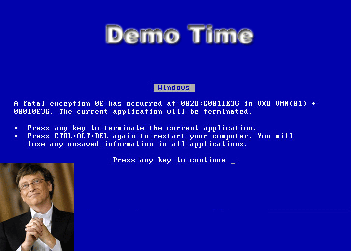

!SLIDE
# Memory Profiling #

!SLIDE
# Tools #

!SLIDE bullets incremental

* Out of Box
* memprof
* gdb.rb
* Using Google Perftools ?

!SLIDE bullets incremental
# What does Ruby 1.9 Provide out of Box? #

* `GC::Profiler.report`

!SLIDE transition=curtainY

.notes run scripts/gc_profile/sample_gc_profile.rb

!SLIDE
# objspace #

* `ObjectSpace.count_objects_size`
* `ObjectSpace.count_nodes`
* `ObjectSpace.count_tdata_objects`

!SLIDE bullets incremental
# memprof #

* Uses trampolines for hooking into Ruby VM, function calls.
* Hooks into `rb_newobj`, `add_freelist`.
* Tracers that can be added to any C function call.

!SLIDE bullets incremental
# Problems #

* Not cross-platform.
* Official version does not work with 1.9.
* Mostly no new development.
* Needs hosted web based visualizer.

!SLIDE bullets incremental
# Good Stuff #

* Dumps heap/stack as JSON.
* Fixed up memprof for 1.9.

!SLIDE bullets incremental
# What it took to run memprof on 1.9? #

* Remove trampolines and patch up Ruby itself.
* Internal data structures have significantly changed between 1.8 and 1.9.
* There is a brand new C API to walk the objectspace.

!SLIDE transition=curtainY

!SLIDE
# Using Memprof.stat #

!SLIDE
# Using Memprof.track #

!SLIDE
# Using Memprof.dump_all #

!SLIDE
# Future of these changes #

* Will be releasing forked version after rubyconf.
* Will be compatible with open sourced memprof.com.

!SLIDE bullets incremental
# GDB.rb #

* gdb hooks for 1.8 (and some for 1.9)
* threads inspection does not work for 1.9.
* Does not work on Mac OSX as well.

!SLIDE transition=curtainY

!SLIDE bullets incremental
* ruby objects
* ruby objects classes
* ruby objects nodes

 

